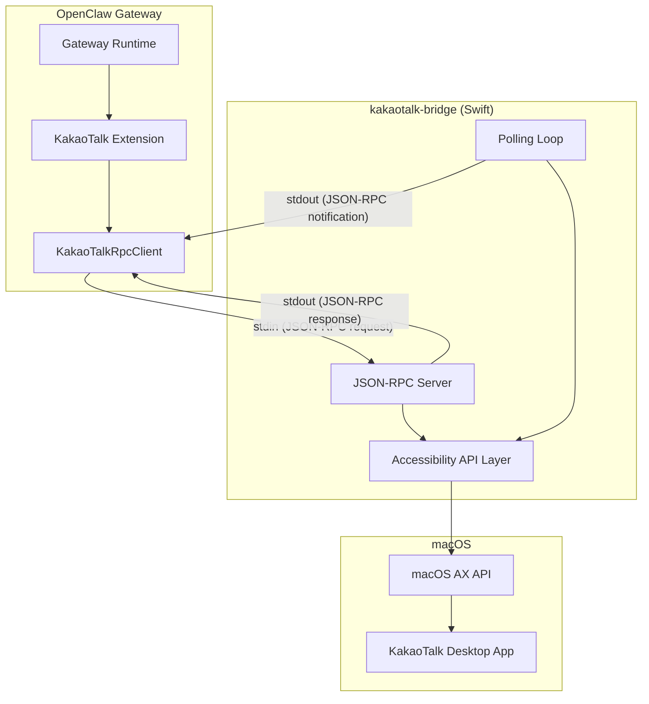

# 설계 문서: KakaoTalk Extension

## 개요

KakaoTalk 데스크톱 앱(macOS)을 OpenClaw 메시징 플랫폼과 연동하는 확장 플러그인이다. KakaoTalk은 공개 API나 CLI를 제공하지 않으므로, macOS Accessibility API를 활용하는 Swift CLI 브릿지(`kakaotalk-bridge`)를 통해 UI를 자동화한다.

아키텍처는 두 계층으로 구성된다:

1. **Swift CLI 브릿지** — macOS AX API로 KakaoTalk UI를 제어하고, JSON-RPC 2.0 over stdio로 통신
2. **TypeScript 확장** — 브릿지를 자식 프로세스로 관리하고, OpenClaw 채널 플러그인 계약을 구현

이 패턴은 기존 `imsg rpc` (iMessage) 구현과 동일하다.

## 아키텍처



### 메시지 흐름

**인바운드 (KakaoTalk → OpenClaw):**

1. Bridge의 Polling Loop가 Chat_List의 읽지 않은 메시지 수 변화를 감지
2. 변화가 감지되면 해당 대화방을 열고 새 메시지를 읽음
3. `new_message` JSON-RPC 알림을 stdout으로 전송
4. RPC_Client가 알림을 수신하여 Extension의 콜백 호출
5. Extension이 OpenClaw 런타임으로 메시지 라우팅

**아웃바운드 (OpenClaw → KakaoTalk):**

1. OpenClaw가 Extension의 `sendText`를 호출
2. Extension이 RPC_Client를 통해 `send_message` 요청 전송
3. Bridge가 대화방 윈도우를 열고 (필요시) 텍스트 입력 + Enter 시뮬레이션
4. 성공/실패 응답 반환

## 컴포넌트 및 인터페이스

### 1. Swift CLI 브릿지 (`kakaotalk-bridge`)

#### 프로젝트 구조

```
kakaotalk-bridge/
  Package.swift
  Sources/
    main.swift          # 진입점, JSON-RPC 서버 루프
    Accessibility.swift # AX API 래퍼 (앱 참조, 권한 확인)
    ChatList.swift      # 채팅 목록 읽기
    ChatRoom.swift      # 채팅방 열기, 메시지 읽기, 메시지 전송
    JsonRpc.swift       # JSON-RPC 2.0 프로토콜 처리
    Polling.swift       # 폴링 루프 (새 메시지 감지)
```

#### JSON-RPC 메서드

| 메서드          | 파라미터           | 응답                                                  |
| --------------- | ------------------ | ----------------------------------------------------- |
| `check_status`  | 없음               | `{ running, accessible, mainWindow }`                 |
| `list_chats`    | `{ limit? }`       | `{ chats: [{ name, lastMessageTime, unreadCount }] }` |
| `open_chat`     | `{ name }`         | `{ success, windowTitle }`                            |
| `read_messages` | `{ name, since? }` | `{ messages: [{ sender, text, time }] }`              |
| `send_message`  | `{ name, text }`   | `{ success }`                                         |

#### 서버 푸시 알림

| 알림          | 파라미터                           |
| ------------- | ---------------------------------- |
| `new_message` | `{ chatName, sender, text, time }` |

#### AX UI 트리 탐색 경로

- **채팅 목록**: `window "카카오톡" > scroll area 1 > table 1 > row N > UI element 1 > static text`
- **채팅방 메시지**: `window "{name}" > scroll area 1 > table 1 > row N > UI element 1 > static text`
- **채팅방 입력 필드**: `window "{name}" > text field` 또는 `text area`
- **채팅방 열기**: Chat_List row에 CGEvent 더블클릭 (AppleScript `select row`/`AXPress` 미작동)

### 2. TypeScript 확장 (`extensions/kakaotalk/`)

#### 프로젝트 구조

```
extensions/kakaotalk/
  index.ts              # 플러그인 진입점
  package.json
  openclaw.plugin.json
  tsconfig.json
  src/
    channel.ts          # ChannelPlugin 구현
    client.ts           # KakaoTalkRpcClient
    client.test.ts      # RPC 클라이언트 테스트
    config-schema.ts    # Zod 설정 스키마
    config-schema.test.ts
    types.ts            # TypeScript 타입 정의
    accounts.ts         # 계정 해석
    send.ts             # 아웃바운드 메시지 전송
    monitor.ts          # 인바운드 메시지 모니터링
    onboarding.ts       # CLI 온보딩 위저드
    probe.ts            # 상태 프로브
    runtime.ts          # PluginRuntime 싱글턴
```

#### KakaoTalkRpcClient (client.ts)

`IMessageRpcClient`와 동일한 패턴:

```typescript
type KakaoTalkRpcNotification = {
  method: string;
  params?: unknown;
};

type KakaoTalkRpcClientOptions = {
  bridgePath?: string;
  pollIntervalMs?: number;
  onNotification?: (msg: KakaoTalkRpcNotification) => void;
};

class KakaoTalkRpcClient {
  constructor(opts?: KakaoTalkRpcClientOptions);
  async start(): Promise<void>; // Bridge 프로세스 생성
  async stop(): Promise<void>; // Bridge 프로세스 종료
  async waitForClose(): Promise<void>;
  async request<T>(
    method: string,
    params?: Record<string, unknown>,
    opts?: { timeoutMs?: number },
  ): Promise<T>;
}
```

- `spawn(bridgePath, ["rpc", "--poll-interval", String(pollIntervalMs)])` 로 Bridge 시작
- stdin/stdout으로 줄바꿈 구분 JSON-RPC 통신
- 요청 ID 기반 pending map으로 응답 매칭
- `id` 없는 메시지는 알림으로 처리

#### 설정 스키마 (config-schema.ts)

```typescript
const kakaotalkAccountSchema = z.object({
  name: z.string().optional(),
  enabled: z.boolean().optional(),
  dmPolicy: z.enum(["pairing", "allowlist", "open", "disabled"]).optional(),
  allowFrom: z.array(z.string()).optional(),
  pollIntervalMs: z.number().int().min(500).max(60000).optional(),
  bridgePath: z.string().optional(),
  textChunkLimit: z.number().int().positive().optional(),
});

export const KakaoTalkConfigSchema = kakaotalkAccountSchema.extend({
  accounts: z.object({}).catchall(kakaotalkAccountSchema).optional(),
});
```

기본값:

- `dmPolicy`: `"pairing"`
- `pollIntervalMs`: `3000` (3초)
- `bridgePath`: `"kakaotalk-bridge"`
- `textChunkLimit`: `4000`

#### ChannelPlugin 구현 (channel.ts)

BlueBubbles/iMessage 패턴을 따르는 `ChannelPlugin<ResolvedKakaoTalkAccount>`:

- **id**: `"kakaotalk"`
- **capabilities**: `{ chatTypes: ["direct"], media: false }`
- **config**: 계정 목록 관리, 해석, allowFrom 처리
- **security**: dmPolicy 기반 접근 제어 (pairing/allowlist/open/disabled)
- **pairing**: 대화방 이름 기반 allowlist
- **outbound**: `send_message` RPC 호출로 메시지 전송
- **status**: `check_status` RPC 호출로 상태 프로브
- **gateway**: Bridge 프로세스 시작, `new_message` 알림 수신 및 라우팅
- **messaging**: 대화방 이름을 타겟 ID로 사용

#### 계정 해석 (accounts.ts)

```typescript
type ResolvedKakaoTalkAccount = {
  accountId: string;
  enabled: boolean;
  name?: string;
  config: KakaoTalkAccountConfig;
  configured: boolean;
};
```

- 기본 계정 ID: `"default"`
- 다중 계정 지원 (accounts 맵)
- 기본 설정과 계정별 설정 병합

#### 메시지 모니터링 (monitor.ts)

```typescript
type KakaoTalkMonitorOptions = {
  account: ResolvedKakaoTalkAccount;
  config: OpenClawConfig;
  runtime: { log?: (msg: string) => void; error?: (msg: string) => void };
  abortSignal: AbortSignal;
};

async function monitorKakaoTalkProvider(opts: KakaoTalkMonitorOptions): Promise<void>;
```

- RPC_Client 생성 및 Bridge 시작
- `new_message` 알림 수신 시 OpenClaw 런타임으로 라우팅
- `abortSignal`로 정상 종료 처리
- Bridge 비정상 종료 시 에러 로깅 및 상태 업데이트

#### 상태 프로브 (probe.ts)

```typescript
type KakaoTalkProbe = {
  ok: boolean;
  running?: boolean;
  accessible?: boolean;
  error?: string | null;
};

async function probeKakaoTalk(params: {
  bridgePath?: string;
  timeoutMs?: number;
}): Promise<KakaoTalkProbe>;
```

- 임시 RPC_Client를 생성하여 `check_status` 호출
- 타임아웃 내 응답 여부로 `ok` 판단

## 데이터 모델

### JSON-RPC 메시지 형식

**요청:**

```json
{ "jsonrpc": "2.0", "id": 1, "method": "list_chats", "params": { "limit": 50 } }
```

**응답 (성공):**

```json
{ "jsonrpc": "2.0", "id": 1, "result": { "chats": [...] } }
```

**응답 (에러):**

```json
{ "jsonrpc": "2.0", "id": 1, "error": { "code": -32601, "message": "Method not found" } }
```

**알림 (서버 푸시):**

```json
{
  "method": "new_message",
  "params": {
    "chatName": "홍길동",
    "sender": "홍길동",
    "text": "안녕하세요",
    "time": "2024-01-15T10:30:00Z"
  }
}
```

### 채팅 항목

```typescript
type KakaoTalkChat = {
  name: string; // 대화방 이름 (상대방 이름 또는 그룹명)
  lastMessageTime: string; // ISO 8601 또는 KakaoTalk 표시 형식
  unreadCount: number; // 읽지 않은 메시지 수
};
```

### 메시지 항목

```typescript
type KakaoTalkMessage = {
  sender: string; // 발신자 이름
  text: string; // 메시지 내용
  time: string; // 시간 정보
};
```

### 설정 구조 (openclaw.yaml)

```yaml
channels:
  kakaotalk:
    enabled: true
    dmPolicy: allowlist
    allowFrom:
      - "홍길동"
      - "개발팀"
    pollIntervalMs: 3000
    bridgePath: /usr/local/bin/kakaotalk-bridge
```

### OpenClaw 플러그인 메타데이터

```json
// openclaw.plugin.json
{
  "id": "kakaotalk",
  "channels": ["kakaotalk"],
  "configSchema": {
    "type": "object",
    "additionalProperties": false,
    "properties": {}
  }
}
```

```json
// package.json (핵심 필드)
{
  "name": "@openclaw/kakaotalk",
  "type": "module",
  "devDependencies": {
    "openclaw": "workspace:*"
  },
  "openclaw": {
    "extensions": ["./index.ts"],
    "channel": {
      "id": "kakaotalk",
      "label": "KakaoTalk",
      "selectionLabel": "KakaoTalk (macOS Accessibility)",
      "detailLabel": "KakaoTalk",
      "blurb": "KakaoTalk via macOS Accessibility API bridge.",
      "aliases": ["kt", "kakao"],
      "systemImage": "message.fill",
      "order": 80
    }
  }
}
```

## 정확성 속성 (Correctness Properties)

_속성(property)이란 시스템의 모든 유효한 실행에서 참이어야 하는 특성 또는 동작이다. 속성은 사람이 읽을 수 있는 명세와 기계가 검증할 수 있는 정확성 보장 사이의 다리 역할을 한다._

> 참고: Bridge(Swift) 측 요구사항(1.1–1.4, 2.x, 3.x, 4.x, 5.x, 6.1–6.3, 7.x)은 macOS AX API와 실제 KakaoTalk 앱이 필요하므로 TypeScript 단위 테스트로 검증할 수 없다. 아래 속성은 TypeScript 확장 코드에서 검증 가능한 항목에 집중한다.

### Property 1: 알림 라우팅 — id 없는 메시지는 알림 콜백으로 전달

_For any_ JSON-RPC 메시지에서 `id` 필드가 없거나 null인 경우, RPC_Client는 해당 메시지를 pending 요청으로 매칭하지 않고 등록된 알림 콜백을 호출해야 한다.

**Validates: Requirements 1.5, 8.3**

### Property 2: 빈 텍스트 거부 — 공백 문자열 전송 차단

_For any_ 공백 문자(스페이스, 탭, 줄바꿈 등)로만 구성된 문자열, 메시지 전송 함수는 RPC 호출 없이 에러를 반환해야 한다.

**Validates: Requirements 6.4**

### Property 3: 요청-응답 ID 매칭

_For any_ 순서대로 전송된 JSON-RPC 요청 시퀀스에서, 응답의 `id`가 요청의 `id`와 일치하면 해당 요청의 Promise가 resolve되고, 다른 pending 요청에는 영향을 주지 않아야 한다.

**Validates: Requirements 8.2**

### Property 4: 프로세스 종료 시 모든 pending 요청 거부

_For any_ pending 요청 집합에서, Bridge 프로세스가 종료되면 모든 pending 요청의 Promise가 에러로 reject되어야 한다.

**Validates: Requirements 8.5**

### Property 5: 설정 스키마 검증 — 유효한 설정 수용, 무효한 설정 거부

_For any_ 유효한 KakaoTalk 설정 객체(올바른 타입의 필드), Zod 스키마 파싱이 성공해야 한다. _For any_ 무효한 설정 객체(잘못된 타입, 범위 초과 값), Zod 스키마 파싱이 실패해야 한다.

**Validates: Requirements 9.2**

### Property 6: DM 정책 적용

_For any_ 대화방 이름과 dmPolicy 설정에서:

- `dmPolicy`가 `"allowlist"`이면, 대화방 이름이 `allowFrom` 목록에 포함된 경우에만 메시지를 수용한다
- `dmPolicy`가 `"open"`이면, 모든 대화방 이름에 대해 메시지를 수용한다
- `dmPolicy`가 `"disabled"`이면, 모든 대화방 이름에 대해 메시지를 거부한다

**Validates: Requirements 9.3, 9.4**

### Property 7: 타겟 정규화 — 대화방 이름 트리밍

_For any_ 전후 공백이 포함된 대화방 이름 문자열, 타겟 정규화 함수는 트리밍된 비어있지 않은 문자열을 반환해야 한다. 빈 문자열이나 공백만 있는 문자열은 에러를 발생시켜야 한다.

**Validates: Requirements 11.2**

## 에러 처리

### Bridge 에러

| 에러 상황            | JSON-RPC 에러 코드        | 처리 방식                 |
| -------------------- | ------------------------- | ------------------------- |
| 잘못된 JSON          | -32700 (Parse error)      | 에러 응답 반환            |
| 존재하지 않는 메서드 | -32601 (Method not found) | 에러 응답 반환            |
| KakaoTalk 미실행     | -32000 (App not running)  | 에러 응답 + 상태 업데이트 |
| AX 권한 없음         | -32001 (No accessibility) | 에러 응답 + 권한 안내     |
| 윈도우 미발견        | -32002 (Window not found) | 에러 응답                 |
| 대화방 미발견        | -32003 (Chat not found)   | 에러 응답                 |
| 입력 필드 미발견     | -32004 (Input not found)  | 에러 응답                 |
| 타임아웃             | -32005 (Timeout)          | 에러 응답                 |

### RPC 클라이언트 에러

| 에러 상황                 | 처리 방식                        |
| ------------------------- | -------------------------------- |
| Bridge 프로세스 시작 실패 | `start()` Promise reject         |
| 요청 타임아웃             | pending Promise reject + cleanup |
| Bridge 비정상 종료        | 모든 pending Promise reject      |
| 잘못된 JSON 응답          | 로깅 후 무시                     |

### Extension 에러

| 에러 상황           | 처리 방식               |
| ------------------- | ----------------------- |
| macOS 아닌 플랫폼   | 채널 비활성 + 경고 로깅 |
| Bridge 연결 실패    | probe `ok: false` 반환  |
| 메시지 전송 실패    | 에러 포함 결과 반환     |
| 빈 메시지 전송 시도 | RPC 호출 전 에러 반환   |

## 테스트 전략

### 테스트 범위

이 프로젝트는 두 계층으로 나뉘며, 각각 다른 테스트 전략이 필요하다:

1. **Swift Bridge**: macOS AX API에 의존하므로 CI에서 자동 테스트 불가. 수동 테스트 및 로컬 통합 테스트로 검증.
2. **TypeScript Extension**: Vitest + fast-check으로 단위 테스트 및 속성 기반 테스트 가능.

### 단위 테스트 (Vitest)

- **config-schema.test.ts**: 설정 스키마 검증 (유효/무효 설정, 기본값, 경계값)
- **client.test.ts**: RPC 클라이언트 로직 (JSON 파싱, 요청-응답 매칭, 알림 라우팅, 에러 처리)
- **types.test.ts**: 타겟 정규화, 유틸리티 함수

### 속성 기반 테스트 (fast-check)

각 속성 테스트는 최소 100회 반복 실행한다.

| 속성       | 테스트 파일           | 태그                                                                    |
| ---------- | --------------------- | ----------------------------------------------------------------------- |
| Property 1 | client.test.ts        | Feature: kakaotalk-extension, Property 1: 알림 라우팅                   |
| Property 2 | send.test.ts          | Feature: kakaotalk-extension, Property 2: 빈 텍스트 거부                |
| Property 3 | client.test.ts        | Feature: kakaotalk-extension, Property 3: 요청-응답 ID 매칭             |
| Property 4 | client.test.ts        | Feature: kakaotalk-extension, Property 4: 프로세스 종료 시 pending 거부 |
| Property 5 | config-schema.test.ts | Feature: kakaotalk-extension, Property 5: 설정 스키마 검증              |
| Property 6 | channel.test.ts       | Feature: kakaotalk-extension, Property 6: DM 정책 적용                  |
| Property 7 | types.test.ts         | Feature: kakaotalk-extension, Property 7: 타겟 정규화                   |

### 테스트 불가 항목

Bridge(Swift) 측 요구사항은 macOS + KakaoTalk 실행 환경이 필요하므로 CI 자동 테스트에서 제외한다:

- AX API 상호작용 (채팅 목록 읽기, 채팅방 열기, 메시지 읽기/전송)
- CGEvent 더블클릭
- 폴링 루프
- KakaoTalk 프로세스/윈도우 감지
